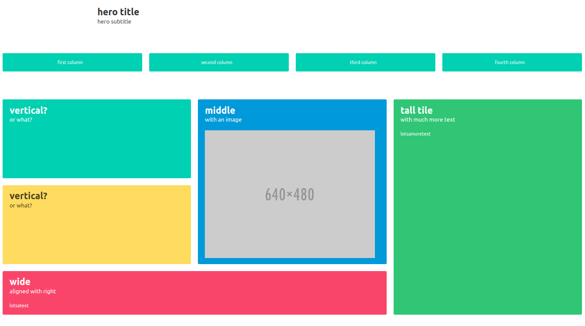
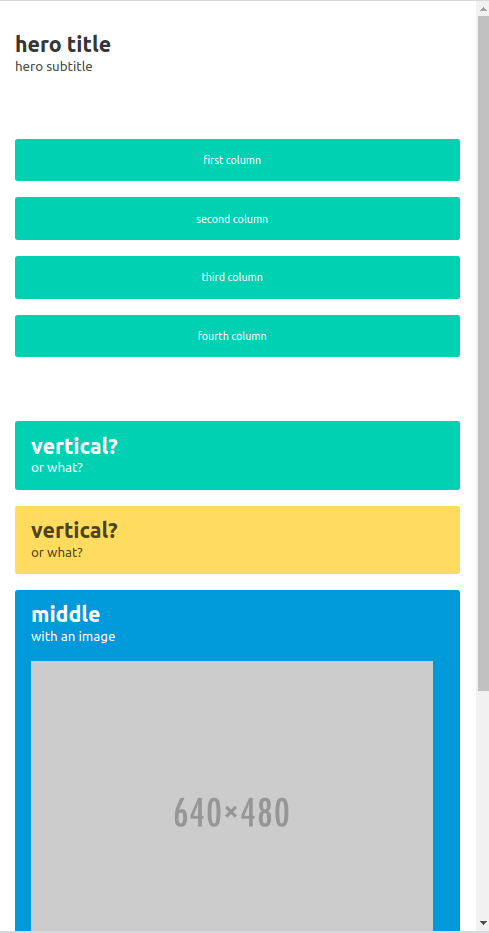
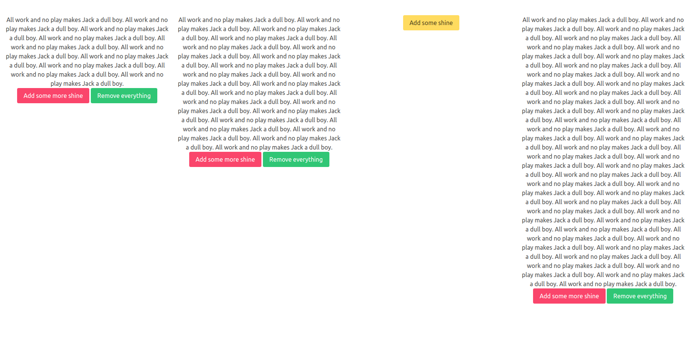

# bulmate 0.0.1

bulmate is a library for creation of server-rendered dynamic, responsive html-pages using bulma as the css library, dominate for tag-rendering, and cccp for the dynamic part, which consists of appending to live dom elements, prepending to live dom elements and replacing live dom elements using callbacks that fetch server rendered snippets. It uses the javascript libraries axios, jquery and fontawesome.

For more of the superpowers of cccp, refer to that project's [excellent documentation and examples](https://github.com/sloev/cccp).

In order to know more about how the inner dynamics of the tag rendering works, refer to the [brilliant documentation](https://github.com/Knio/dominate) of dominate.

Finally Bulma. There is no way You can use this library effectively without reading some of the [extraordinarily bright bulma documentation](https://bulma.io/documentation/).

## Responsive rendering

An reasonably comprehensive example in a flask view could look like this - it will showcase **section**, **hero**, **columns**, and **tile**.

### The wide version

### The tall version

Here is the current code

    @blueprint.route('/', methods=["GET"])
    def root():
        return t.html([
    	t.head([bulmate.init(cors=True)]),
    	t.body([
    	    t.hero([
    		t.hero_body([
    		    t.container([
    			t.h1("hero title", cls="title"),
    			t.h2("hero subtitle", cls="subtitle"),
    		    ])
    		]),
    	    ]),
    	    t.section([
    		t.columns([
    		    t.column([t.notification("first column", cls="is-primary has-text-centered")]),
    		    t.column([t.notification("second column", cls="is-primary has-text-centered")]),
    		    t.column([t.notification("third column", cls="is-primary has-text-centered")]),
    		    t.column([t.notification("fourth column", cls="is-primary has-text-centered")]),
    		])
    	    ]),
    	    t.section([
    		t.tile([
    		    t.tile([
    			t.tile([
    			    t.tile([
    				t.tile([
    				    t.p("vertical?", cls="title"),
    				    t.p("or what?", cls="subtitle"),
    				], cls="is-child notification is-primary", tagname="article"),
    				t.tile([
    				    t.p("vertical?", cls="title"),
    				    t.p("or what?", cls="subtitle"),
    				], cls="is-child notification is-warning", tagname="article"),
    			    ], cls="is-parent is-vertical"),
    			    t.tile([
    				t.tile([
    				    t.p("middle", cls="title"),
    				    t.p("with an image", cls="subtitle"),
    				    t.image([t.img(src="https://bulma.io/images/placeholders/640x480.png")], cls="is-4by3"),
    				], cls="is-child notification is-info", tagname="article"),
    			    ], cls="is-parent"),
    			]),
    			t.tile([
    			    t.tile([
    				t.p("wide", cls="title"),
    				t.p("aligned with right", cls="subtitle"),
    				t.content("lotsatext"),
    			    ], cls="is-child notification is-danger", tagname="article"),
    			], cls="is-parent"),
    		    ], cls="is-vertical is-8"),
    		    t.tile([
    			t.tile([
    			    t.tile([
    				t.p("tall tile", cls="title"),
    				t.p("with much more text", cls="subtitle"),
    				t.content("lotsamoretext"),
    			    ], cls="is-child notification is-success", tagname="article"),
    			] ),
    		    ], cls="is-parent"),
    		], cls="is-ancestor")
    	    ]),
    	]),
        ]).render()

## dynamic pages with server rendered snippets

### A Shining example

    import flask
    import bulmate
    import bulmate.tags as t
    import cccp
    import uuid
    
    app = flask.Flask(__name__)
    
    def column_jack(letter):
        return t.column(
            id="coll_"+letter,
            cls=["is-primary", "has-text-centered"],
            children = [
                t.div(
                    id="shine_" + letter,
                ),
                t.div(
                    id="butt_" + letter,
                    children= [
                        t.button(
                            cls=["is-warning"],
                            onclick=[
                                cccp.replaceHtml("/more_buttons/?letter="+letter, "butt_"+letter),
                                cccp.appendHtml("/shine/", "shine_"+letter),
                            ],
                            children=["Add some shine"],
                        ),
                    ],
                )
            ])
    
    
    @app.route('/shine/')
    def shine():
        return "All work and no play makes Jack a dull boy. " * 10
    
    
    @app.route('/')
    def index():
        return t.html(
            children=[
        	    t.head([bulmate.init(cors=True)]),
        	    t.body(
                    children=[
                        t.section(
                            children=[t.columns([column_jack(letter) for letter in "jack"])]
                        ),
                    ],
                ),
            ]).render()
    
    
    @app.route('/more_buttons/')
    def more_buttons():
        letter = flask.request.args["letter"]
        return t.div(
            children=[
                t.button(
                    cls=["is-danger"],
                    onclick=cccp.appendHtml("/shine/", "shine_" + letter),
                    children=["Add some more shine"],
                ),
                t.button(
                    cls=["is-success"],
                    onclick=[
                        cccp.replaceHtml("/nothing/", "shine_" + letter),
                        cccp.replaceHtml("/one_button/?letter=" + letter, "butt_" + letter),
                    ],
                    children=["Remove everything"],
                ),
            ]
        ).render()
    
    @app.route('/one_button/')
    def one_button():
        letter = flask.request.args["letter"]
        return t.div(
            children= [
                t.button(
                    cls=["is-warning"],
                    onclick=[
                        cccp.replaceHtml("/more_buttons/?letter="+letter, "butt_"+letter),
                        cccp.appendHtml("/shine/", "shine_" + letter)
                    ],
                    children=["Add some shine"],
                ),
            ],
        ).render()
    
    
    @app.route('/nothing/')
    def nothing():
        return t.comment("all has been deleted").render()
    
    
    if __name__ == "__main__":
        import os
        app.run(debug=True, host=os.environ.get("HOST","127.0.0.1"))
    
    

### Only the wide version shown

## rendered tags, alphabetically

Here is, for each tag, how it renders with no arguments, for example:

    import bulmate.tags as t
    t.panel().render()
    t.panel(cls="is-success").render()
    t.panel(cls=["is-success", "my-own-class"]).render()
    t.panel(cls="is-success my-own-class").render()
    t.panel(cls=["is-success", "my-own-class"], children=[t.p("some text")]).render()

would produce

    '<article class="panel"></article>'
    '<article class="panel is-success"></article>'
    '<article class="panel is-success my-own-class"></article>'
    '<article class="panel is-success my-own-class"></article>'
    '<article class="panel is-success my-own-class">\n  
some text
\n</article>'

using the **children** keyword is an addition compared to vanilla dominate - it makes sense to be 
able to transfer children as a keyword argument, as the example above seems bulky for bulma,
specifying the classes always at the end of the arguments.

### bulmate.init

The **bulmate.init** function is special, because it has no outer tag of it's own, it simply appends to the surrounding tag which should be **head**.

    
    <link href="https://cdn.jsdelivr.net/npm/bulma@0.8.0/css/bulma.min.css" rel="stylesheet">
    
    
    
    
    
    

### \_input

    <input class="input"></input>

### \_object

    <object></object>

### \_time

    <time></time>

### a

    

### abbr

    <abbr></abbr>

### address

    <address></address>

### area

    <area>

### article

    <article></article>

### aside

    <aside></aside>

### audio

    <audio></audio>

### b

    <b></b>

### base

    <base>

### bdi

    <bdi></bdi>

### bdo

    <bdo></bdo>

### blockquote

    <blockquote></blockquote>

### body

    <body></body>

### box

    

### br

     

### breadcrumb

    <nav class="breadcrumb"></nav>

### button

    

### buttons

    

### canvas

    <canvas></canvas>

### caption

    <caption></caption>

### card

    

### card\_content

    

### card\_footer

    

### card\_footer\_item

    

### card\_header\_icon

    

### card\_header\_title

    

### card\_image

    

### checkbox

    <label class="checkbox"></label>

### cite

    <cite></cite>

### code

    <code></code>

### col

    <col>

### colgroup

    <colgroup></colgroup>

### column

    

### columns

    

### command

    <command>

### comment

    <!---->

### container

    

### content

    

### control

    

### datalist

    <datalist></datalist>

### dd

    <dd></dd>

### del\_

    <del></del>

### delete

    <button class="delete"></button>

### details

    

### dfn

    <dfn></dfn>

### div

    

### dl

    <dl></dl>

### dropdown\_content

    

### dropdown\_divider

    

### dropdown\_menu

    

### dropdown\_trigger

    

### dt

    <dt></dt>

### em

    <em></em>

### embed

    <embed>

### field

    

### fieldset

    <fieldset></fieldset>

### figcaption

    <figcaption></figcaption>

### figure

    <figure></figure>

### file

    

### file\_cta

    

### file\_icon

    

### file\_input

    <input class="file-input"></input>

### file\_label

    <label class="file-label"></label>

### file\_name

    

### font

    

### footer

    <footer class="footer"></footer>

### form

    <form></form>

### h1

    <h1></h1>

### h2

    <h2></h2>

### h3

    <h3></h3>

### h4

    <h4></h4>

### h5

    <h5></h5>

### h6

    <h6></h6>

### head

    <head></head>

### header

    <header></header>

### hero

    <section class="hero"></section>

### hero\_body

    

### hgroup

    <hgroup></hgroup>

### hr

    

### html

    <html></html>

### i

    <i></i>

### icon

    

### iframe

    <iframe></iframe>

### image

    <figure class="image"></figure>

### img

    

### input

    <input class="input"></input>

### input\_

    <input class="input"></input>

### ins

    <ins></ins>

### kbd

    <kbd></kbd>

### keygen

    <keygen>

### label

    <label class="label"></label>

### legend

    <legend></legend>

### li

    <li></li>

### link

    <link>

### main

    <main></main>

### map\_

    <map></map>

### mark

    <mark></mark>

### media

    

### media\_content

    

### media\_left

    

### media\_right

    

### menu

    <aside class="menu"></aside>

### menu\_label

    

### menu\_list

    <ul class="menu-list"></ul>

### message

    <article class="message"></article>

### message\_bodydropdown

    

### message\_header

    

### meta

    <meta>

### meter

    <meter></meter>

### modal

    

### modal\_background

    

### modal\_close

    <button class="modal-close"></button>

### modal\_content

    

### nav

    <nav></nav>

### navbar

    <nav class="navbar"></nav>

### navbar\_brand

    

### navbar\_end

    

### navbar\_item

    

### navbar\_start

    

### noscript

    <noscript></noscript>

### notification

    

### object\_

    <object></object>

### ol

    <ol></ol>

### optgroup

    <optgroup></optgroup>

### option

    <option></option>

### output

    <output></output>

### p

    

### pagination

    <nav class="pagination"></nav>

### pagination\_ellipsis

    

### pagination\_link

    

### pagination\_list

    <ul class="pagination-list"></ul>

### pagination\_next

    

### pagination\_previous

    

### panel

    <article class="panel"></article>

### panel\_block

    

### panel\_heading

    

### panel\_tabs

    

### param

    <param>

### pre

    <pre></pre>

### progress

    <progress class="progress"></progress>

### q

    <q></q>

### radio

    <input class="radio"></input>

### rp

    <rp></rp>

### rt

    <rt></rt>

### ruby

    <ruby></ruby>

### s

    <s></s>

### samp

    <samp></samp>

### script

    

### section

    <section class="section"></section>

### select

    

### small

    <small></small>

### source

    <source>

### span

    

### strong

    <strong></strong>

### style

    

### sub

    

### subtitle

    

### summary

    

### sup

    

### table

    <table></table>

### tabs

    

### tag

    

### tbody

    <tbody></tbody>

### td

    <td></td>

### textarea

    <textarea class="textarea"></textarea>

### tfoot

    <tfoot></tfoot>

### th

    <th></th>

### thead

    <thead></thead>

### tile

    

### time\_

    <time></time>

### title

    

### tr

    <tr></tr>

### track

    <track>

### u

    <u></u>

### ul

    <ul></ul>

### var

    <var></var>

### video

    <video></video>

### wbr

    <wbr>

## History

### Version 0.0.2 - Mar 15, 2020

 * typos, additional image, onclick as list possible, more docs, examples

### Version 0.0.1 - Mar 15, 2020

 * first

